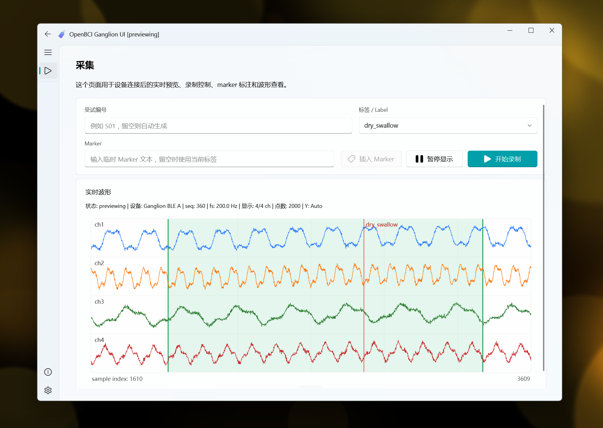

<p align="center">
  
</p>

<h1 align="center">OpenBCI Ganglion UI</h1>

<p align="center">
  这是一个基于 <code>PyQt6</code> 和 <code>PyQt6-Fluent-Widgets</code> 的桌面采集界面项目，使用 <code>uv</code> 管理依赖与环境。
</p>



## 安装 uv

### 官方安装脚本

Windows：

```powershell
powershell -ExecutionPolicy ByPass -c "irm https://astral.sh/uv/install.ps1 | iex"
```

macOS 和 Linux：

```bash
curl -LsSf https://astral.sh/uv/install.sh | sh
```

### 使用 pipx 安装

如果你已经安装了 `pipx`，也可以直接安装 `uv`：

```bash
pipx install uv
```

参考官方文档：
- `uv` 安装文档：https://docs.astral.sh/uv/getting-started/installation/

## 快速开始

安装项目依赖并启动：

```bash
uv sync
uv run openbciganglionui
```

也可以用模块方式启动：

```bash
uv run python -m openbciganglionui
```

## 项目结构

```text
src/openbciganglionui/
  app.py          # QApplication 启动入口
  backend/        # backend 协议、事件模型和 mock 实现
  ui/             # 页面、窗口、设置管理和组件
  __main__.py     # python -m 入口
```

## 开发

安装开发依赖：

```bash
uv sync --dev
```

运行检查：

```bash
uv run ruff check .
```

## 打包

当前仓库提供的是 Windows 下的 mock data 演示版打包脚本：

```powershell
uv sync --dev
powershell -ExecutionPolicy Bypass -File .\scripts\build_mock_demo.ps1
```

打包结果会输出到 `release/`。

## 平台说明

- 源码运行主要依赖 `PyQt6`、`numpy` 和 `PyQt6-Fluent-Widgets`，代码本身没有明显写死 Windows 运行逻辑。
- 因此，源码方式在 Linux 上预计也是可以运行的，`uv sync` 正常情况下也不应有问题。
- 但目前我只实际验证了 Windows 环境，Linux 还没有做过完整运行测试。
- 打包脚本 `scripts/build_mock_demo.ps1` 是 Windows 专用脚本，不适用于 Linux。
